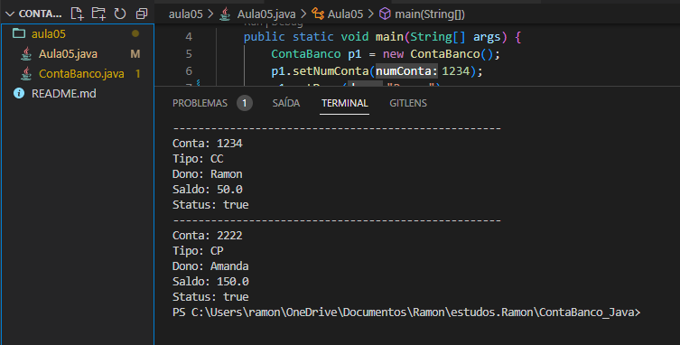
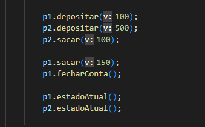
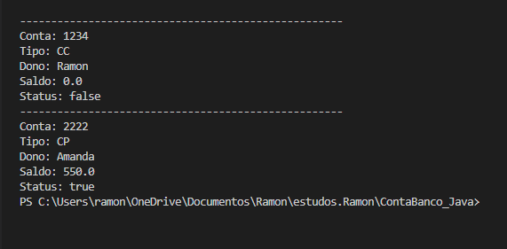

## Código - 🏧 Conta Banco 💸

### CursoemVídeo - Java POO ☕

Código desenvolvido como resultado da aula 05 do Curso de Java Orientado a Objetos do Curso em Vídeo. Esse programa foi desenvolvido para simular o transações bancárias. Utilizado o <strong>Encapsulamento</strong> dos atributos e exercitando os Métodos <strong>Get</strong> and <strong>Setters</strong>.

O programa vai exibir na tela os atributos da conta (Nº da conta, Tipo, Dono, Saldo e Status), identificando o estado (Aberta ou Fechada) e ação solicitada através dos Métodos Personlizados (Depositar, Sacar, Fechar Conta).

### Características do Programa 

- [x] Elaboração de um programa para simular Transações Bancárias, similar a <strong>Bancos</strong>
- [x] A Conta pode ter dois tipos: Corrente ou Poupança
- [x] A Conta Corrente inicia-se com saldo de: 💲50 💰
- [x] A Conta Poupança inicia-se com saldo de: 💲150 💰
- [x] A Conta só pode ser fechada se não tiver dinheiro e não possuir débitos
- [x] Só é possível depositar e sacar de uma conta existente
  
## Compilação 👨🏽‍💻
### Preview - Abertura da conta

  

### Utilizando os Métodos Personalizados 

  

### Preview - Métodos Personalizados

  

- [x] A Conta Corrente do <strong>Ramon</strong> foi fechada com sucesso!
- [x] A Conta Poupança da <strong>Amanda</strong> possuí saldo de 💲550 após as ações com os Métodos Persolanizados

## Tecnologias 🛠

- Java POO ☕

## Instrutor 👨🏽‍🏫
- <a target="_blank" href="https://www.linkedin.com/in/guanabara/">Gustavo Guanabara</a>

